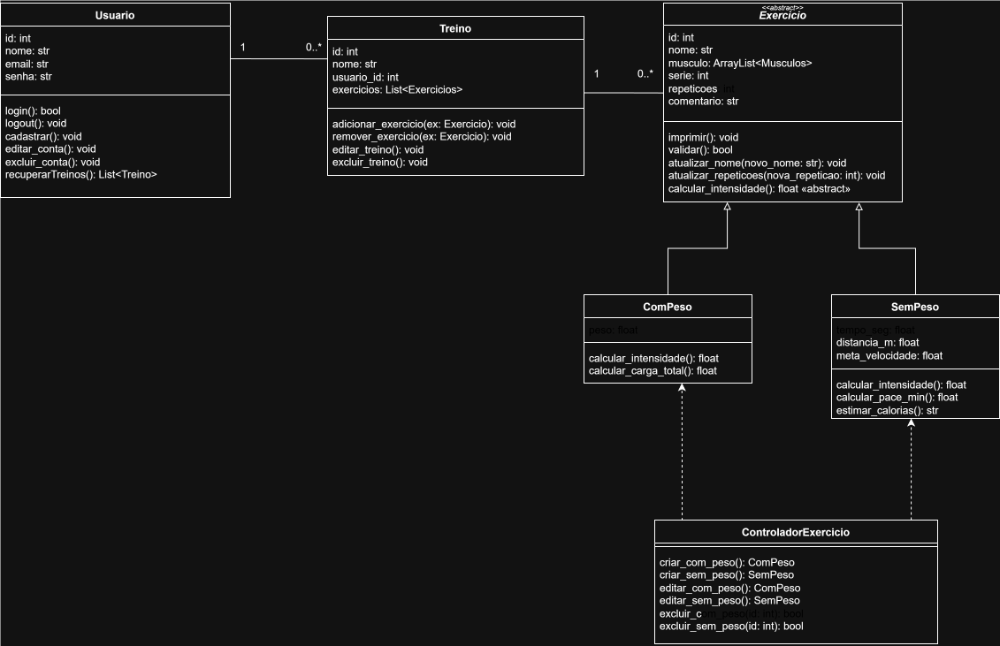
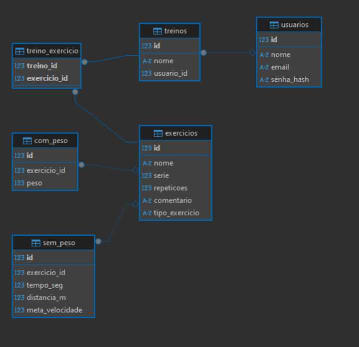

# Trabalho de TPPE

### Aqui se encontram as minhas refatorações, correções e novas funcionalidades do projeto "Crie Seu Treino" para a disciplina de POO

## Objetivos

- Adicionar novos requisitos.
- Prototipar a solução.
- Criar uma arquitetura diferente de MVC.
- Criar Pipelines.
- Fazer Testes Unitários.
- Adicionar lint.
- Seguir a pep8.
- Criar uma persistência de dados em banco.
- Criar um ambiente de desenvolvimento virtualizado (Docker).

---

## Estrutura de Requisitos

### Épicos e Features

| Épico | Descrição                            |
| ----- | ------------------------------------ |
| E01   | Gestão de Conta do Usuário           |
| E02   | Gestão de Treinos e Exercícios       |
| E03   | Visualização e Interação com Treinos |

| Feature | Descrição               |
| ------- | ----------------------- |
| FT01    | Conta do Usuário        |
| FT02    | Treinos                 |
| FT03    | Exercícios com Peso     |
| FT04    | Exercícios sem Peso     |
| FT05    | Visualização de Treinos |

---

## Backlog do Produto

# Backlog do Produto

| Épico | Feature | US   | Descrição                                                                                                    |
| ----- | ------- | ---- | ------------------------------------------------------------------------------------------------------------ |
| E01   | FT01    | US01 | Eu, como usuário, gostaria de me registrar no sistema.                                                       |
| E01   | FT01    | US02 | Eu, como usuário, gostaria de fazer login no sistema.                                                        |
| E01   | FT01    | US03 | Eu, como usuário, gostaria de fazer logout da minha conta.                                                   |
| E01   | FT01    | US04 | Eu, como usuário, gostaria de visualizar meus dados da conta.                                                |
| E01   | FT01    | US05 | Eu, como usuário, gostaria de editar meus dados da conta.                                                    |
| E01   | FT01    | US06 | Eu, como usuário, gostaria de excluir minha conta.                                                           |
| E02   | FT02    | US07 | Eu, como usuário, gostaria de criar um treino com exercícios personalizados.                                 |
| E02   | FT02    | US08 | Eu, como usuário, gostaria de visualizar os treinos criados.                                                 |
| E02   | FT02    | US09 | Eu, como usuário, gostaria de editar um treino existente.                                                    |
| E02   | FT02    | US10 | Eu, como usuário, gostaria de excluir um treino.                                                             |
| E02   | FT03    | US11 | Eu, como usuário, gostaria de criar exercícios com peso, informando nome, músculo, repetições, sets e carga. |
| E02   | FT03    | US12 | Eu, como usuário, gostaria de editar exercícios com peso.                                                    |
| E02   | FT03    | US13 | Eu, como usuário, gostaria de excluir exercícios com peso.                                                   |
| E02   | FT04    | US14 | Eu, como usuário, gostaria de criar exercícios sem peso, informando nome, tempo e distância.                 |
| E02   | FT04    | US15 | Eu, como usuário, gostaria de editar exercícios sem peso.                                                    |
| E02   | FT04    | US16 | Eu, como usuário, gostaria de excluir exercícios sem peso.                                                   |
| E03   | FT05    | US17 | Eu, como usuário, gostaria de visualizar uma lista de treinos e selecionar um para ver os detalhes.          |
| E03   | FT05    | US18 | Eu, como usuário, gostaria de visualizar os detalhes de um treino com todos os exercícios listados.          |

---

## Arquitetura do Sistema

Este projeto segue uma arquitetura de microsserviços com:

### Backend (API)
- **FastAPI** - Framework web Python
- **PostgreSQL** - Banco de dados relacional
- **SQLAlchemy** - ORM para Python
- **JWT** - Autenticação via tokens
- **Pytest** - Testes unitários e de integração

### Frontend (Web)
- **Next.js 14** - Framework React
- **TypeScript** - Tipagem estática
- **Tailwind CSS** - Framework CSS utilitário
- **Axios** - Cliente HTTP para comunicação com a API

### Containerização
- **Docker** - Containerização dos serviços
- **Docker Compose** - Orquestração dos containers

## Como Executar

### Pré-requisitos
- Docker e Docker Compose instalados
- Arquivo `.env` configurado (use `.env.example` como base)

### Executar toda a aplicação

```bash
# Clonar o repositório
git clone <url-do-repositorio>
cd TrabalhoTPPE

# Criar arquivo .env (copie do .env.example e ajuste conforme necessário)
cp .env.example .env

# Subir todos os serviços
docker-compose up --build

# Ou em modo detached (segundo plano)
docker-compose up -d --build
```

### Acessar os serviços

- **Frontend**: http://localhost:3000
- **Backend API**: http://localhost:8000
- **Documentação da API**: http://localhost:8000/docs
- **PostgreSQL**: localhost:2543

### Executar apenas o backend

```bash
docker-compose up db backend --build
```

### Executar testes

```bash
docker-compose run backend-test
```

## Diagrama UML



## Diagrama Banco de dados


